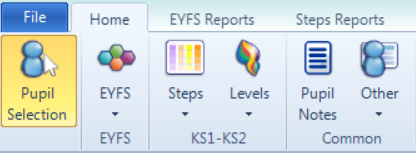
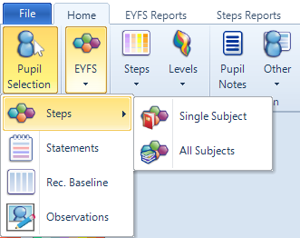
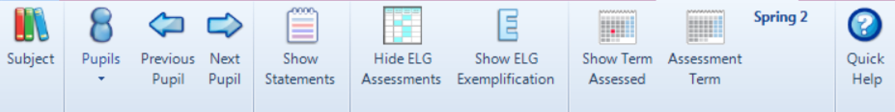
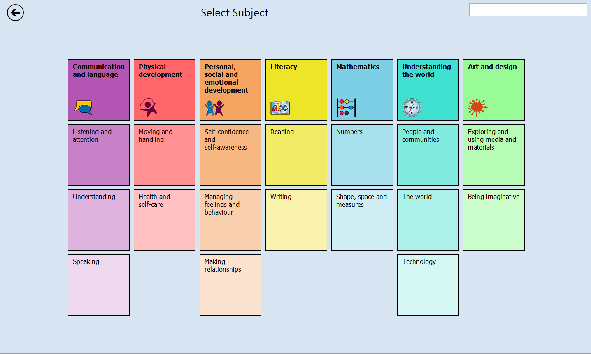
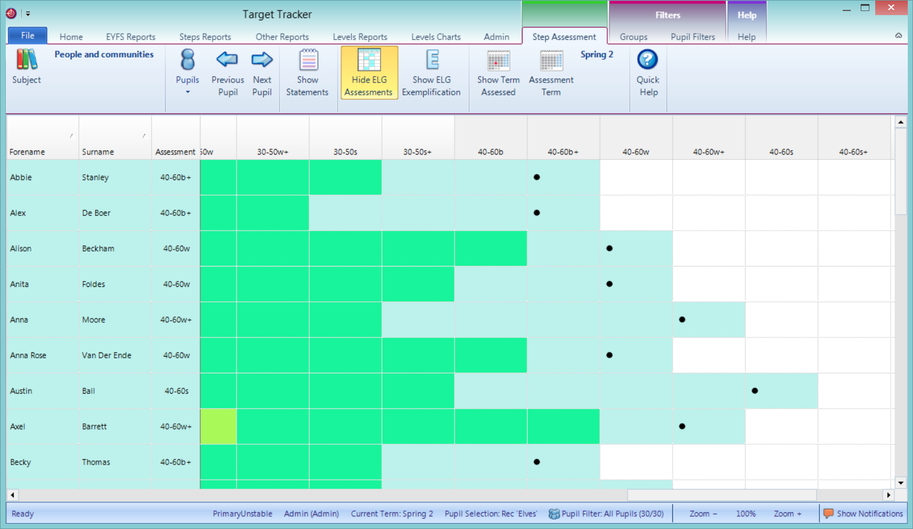
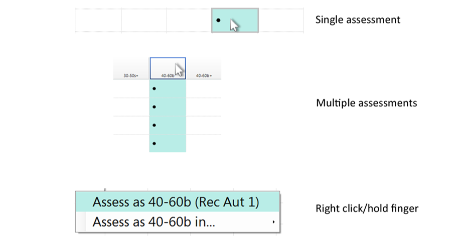
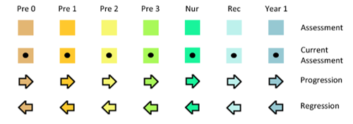
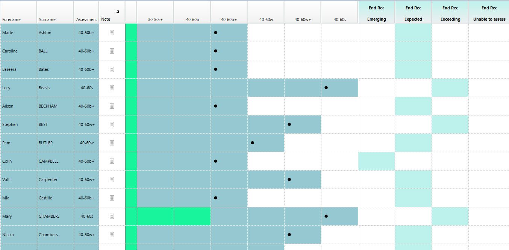

## Introduction

The EYFS Steps Assessment Entry tool allows EYFS assessments to be entered from birth to the end of Year 1.

To begin, select a year group (or year groups) or class (or classes) from the Pupil Selection screen.

From the `Home` tab choose the `EYFS` menu.

Choose `Steps` and you will see the options `Single Subject` or `All Subjects`. Single Subject allows you to choose a subject to view or enter assessments for all pupils. All Subjects allows you to choose a pupil to view or enter assessments for all subjects.
Both work in much the same way but have different applications. 

The Single Subject view is likely to be the most useful for day to day assessment entry and the All Subjects view is useful for pupil progress meetings or when your focus is on a single pupil over the whole curriculum. We will focus on the Single Subject view here.

Choose the `Subject` button.

The Subject selection shows the Areas of Learning (AoLs) on the top row and the individual Aspects beneath.
You can enter/view assessments for either. Assessments entered for an AoL will apply to all the associated Aspects. Assessments entered for Aspects will be used as an average for the AoL.

If you would rather work with a saved group, specific pupil or pupils then the `Pupils` menu gives a quick way to do this. The `Previous Pupil` and `Next Pupil` buttons allow you to move through pupil by pupil

The Pupil selection screen shows all the pupil names in alphabetical order by forename. If the pupils do not all fit you can use the small arrows (in the middle on the left and right of the screen), a mouse wheel or keyboard arrow keys to scroll. You can use your fingers to swipe left and right on a tablet PC. The search box at the top of the screen allows you to type the first few letters of the pupil name to quickly find them.

You may want to show the assessments associated with each band beneath the Steps. Click `Show Statements` to do this. Statements may be assessed in this view but it may be easier to do this in the Statements assessment screen.

!!! note
    When entering assessments in the All Subjects view you will see all of the Areas of Learning, in bold, and their associated Aspects beneath. The Hide AoLs button temporarily removes the Area of Learning rows. This can be useful if you are entering assessments from paper notes in Aspect order.

## Beginning, Working Within and Secure

The assessments are made through each of the month bands. To allow progress to be easily represented these are arranged in Steps. These are broadly arranged as Beginning in the month band, Working Within the month band and Secure in the month band.

To allow fine progress measures these are then further broken down to allow an additional Plus assessment in each case. For example, you may assess a pupil as Secure in the 30-50 months band at the end of a half term. At the end of the following half term your best fit assessment may not yet place the pupil as beginning in the 40-60 month band but that pupil has made progress. To allow that progress to be shown you may choose to assess the pupil as 30-50s+.

After the 40-60 band there are 3 additional steps to indicate pupils working beyond the expectations of the Reception year and now demonstrating a best fit of beginning the expectations for year 1. These are 1b (band 1 beginning), 1b+ and above 1b+.

## Entering Assessments

To enter a Step assessment simply find the cell for the pupil and Step and double click (or double tap on a tablet pc). This will enter an assessment for the pupil and automatically attribute a half term to it based on today's date (this is taken from your PC so ensure the date and time are correct).

If you want to save time by entering the same assessment for multiple pupils double click (or double tap) on the appropriate column header. A confirmation message will appear which allows you to quickly enter several assessments for pupils at the same level. Individual pupil assessments may then be 'fine tuned' by clicking the appropriate cell on an individual pupil row.

!!! tip
    If you have ability groups saved you could work with each saved group in turn and quickly enter assessments.

It is possible that you are entering assessments for a previous half term. The `Assessment Term` button allows you to choose to assess in the current or previous half term (unless the previous half term is in the previous academic year). Once you choose the previous half term any assessments entered via a double click will be recorded against the previous half term until you change the selection or exit.

If you want to enter assessments for a half term prior to the previous half term then right clicking (or holding your finger) on the appropriate cell displays an additional menu. If your user permission level permits it you can use this menu to select from any previous half term.

This menu also allows you to delete any assessment entered in error.
The cell colour represents the year the assessments are entered. From Year 1 to Pre School 0 (year of birth).

If a pupil assessment is lower than one entered in a previous half term left facing arrows indicate the number of Steps regressed. When the pupil progresses right facing arrows show that progression up to the original higher assessment.

## End of Reception outcomes - Emerging, Expected, Exceeding

In the Summer term of the Reception year you need to enter the final assessments to submit to the Local Authority.
If your year group selection is Reception and the current term is Spring or Summer the final Reception assessments will automatically be shown.

!!! note
    As the end of Reception assessments are by Aspect, they are not shown if you choose to show an Area of Learning from the Subject selection

These work in the same way as the Step assessments via a double click (or tap). It is also possible to double click the column header to enter an assessment for multiple pupils. The Unable to Assess assessment is chiefly to allow you to state that a pupil has recently joined and it has not been possible to assess. This applies to all Aspects, not just the one you double click for.

To aid these assessments you can click the `Show ELG Exemplification` button. This will open a viewer in which exemplars for Expected and text descriptors for Exceeding may be viewed.
