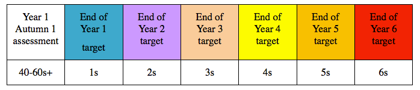

### Approach to Assessment and Progress Tracking in the New Curriculum

In April 2014 the Department for Education released 'Assessment Principles', a document outlining the core values all effective assessment systems should implement as part of the changes introduced with the 2014 National Curriculum. As the ‘Government will not impose a single system for ongoing assessment’, it is up to schools to implement a system that can: ‘Give reliable information to parents about how their child, and their child’s school, is performing, help drive improvement for pupils and teachers and make sure the school is keeping up with external best practice and innovation.’

We have been developing an effective assessment system that will meet the needs of all school stakeholders and support the school in embedding the DfE ‘Assessment Principles’ referenced above.

This has been developed to ensure that the useful elements of the outgoing levels system are retained, ensuring data from school to pupil level is presented and recorded with clarity and consistency, while removing the more confusing elements and opportunities for bad practice, for example the inconsistent APS system.
It also seeks to embrace the more forward thinking facets of assessment in the new curriculum, in particular a mastery model with a focus on embedding rather than pace.

### Our Philosophy of Assessment 

Assessment should have a purpose at every level for everyone involved:

Pupils should be given appropriate feedback on their learning from the formative assessments carried out by class teachers.
Class teachers should be able to use formative assessment to support planning and implementation of a curriculum designed to meet the needs of learners.
Teachers and school leaders should be able to use assessment to help ensure that the pupils who need specified intervention are quickly identified, appropriately supported and monitored so that all can fully achieve their potential and no one is left to struggle behind.
School Leaders should be able to use summative assessment as a tool for monitoring the progress and attainment pupils make, to ensure the school is helping pupils achieve their potential.
Parents should be able to get a clear and accurate sense of their child’s achievement and progress as well as areas where they can support development.
Governors should be able to use data to ensure the school is supporting pupils learning effectively.
Schools can provide data for inspection teams to show how children are performing.

### Our Assessment System

Our assessment system has been developed carefully to meet DfE guidance and Our Philosophy of Assessment.

### Tracking Attainment with Statements

At its heart, any assessment tool must have Assessment for Learning and this is the fundamental building block on which any more expansive data must sit.

The new National Curriculum has set out clear expectations for what children should achieve by the end of each key stage and, for English, Maths and Science, has provided guidance as to when in each phase this content should be covered. The programme of study expected end of year outcomes have been adapted to help support practitioners in making their step judgements over each academic year. These formative statements may be shared with pupils to help define and guide next steps in learning. As a key time saving element the Target Tracker software has been designed to allow group assessment entry and reports to get a quick and visual snapshot of pupil achievement.

The statutory statements published in the National Curriculum show end of year expectations. Our curriculum advisers have worked collaboratively with highly skilled practitioners to produce guidance and exemplification to support transition and, a key concern with any new system, moderation.  These examples are presented in the Target Tracker software as additional statements of guidance, examples of children’s work, or a video file with audio.

This supporting guidance is available for English, Maths, Science and Computing.

### Tracking Attainment and Progress with Steps

To track pupil attainment we have devised a system of steps. This performs the function of communicating progression and attainment in a simple format that may be aggregated to produce reports of overall and average progress. This is based on a carefully considered logical approach to assessment and follows on from the assessment system we have introduced in EYFS.

The terminology has been selected for consistency and clarity but also to avoid any suggested judgement when describing the attainment of pupils working below the expected band for their year group.

Each year band has been broken down into six steps:

- beginning (b)
- beginning + (b+)
- working within (w)
- working within + (w+)
- secure (s)
- secure + (s+)

The three broader sections may be thought of in these terms:

### Definition lists

Lorem ipsum dolor sit amet

:   Sed sagittis eleifend rutrum. Donec vitae suscipit est. Nullam tempus
    tellus non sem sollicitudin, quis rutrum leo facilisis. Nulla tempor
    lobortis orci, at elementum urna sodales vitae. In in vehicula nulla.

    Duis mollis est eget nibh volutpat, fermentum aliquet dui mollis.
    Nam vulputate tincidunt fringilla.
    Nullam dignissim ultrices urna non auctor.

Cras arcu libero

:   Aliquam metus eros, pretium sed nulla venenatis, faucibus auctor ex. Proin
    ut eros sed sapien ullamcorper consequat. Nunc ligula ante, fringilla at
    aliquam ac, aliquet sed mauris.

Beginning

:   Pupil learning is chiefly focussed on the criteria for the band. There may be minimal elements of the previous band still to gain complete confidence in

Working Within

:   Pupil learning is fully focussed on the criteria for the band. This is a teacher best fit decision but could be informed by statement assessments between around 40% and 70% achieved.

Secure 

:  Confidence in all of the criteria for the band. There may be pupil learning still focussed on gaining thorough confidence in some minimal elements but the broad expectations for the band have been met

Where the sections have been broken down into steps this is designed to allow the practitioner to represent and report progress for a pupil where they may not feel that the best fit is within the next section. For example, a pupil may be assessed as Band 2 Beginning in the Autumn term in year 2. The next time the practitioner records a summative assessment they may not feel that the pupil has progressed to Working Within, but the pupil has made progress. An assessment of Beginning + allows that progress to be represented and will feed through to overall class and key stage reporting. The inability to record smaller progress measures was a frustrating issue with the outgoing levels (and points) system.

At appropriate termly or half termly intervals, practitioners select a step to show where each pupil is working. Lower and high achieving pupils may be working at a band outside of their current year, and can be recorded as such.

Practitioners may assess steps in core and foundation subjects:

To allow for the tracking and analysis of progress in a statistical context we have adopted a one point scale. The numbers below each step reference the equivalent scale point.

This means it will be easy for schools to monitor pupil attainment in the context of age related expectation and progress over time to help children reach the new secondary ready standard.

Secure + effectively represents the consolidation of the band and, while pupils will still need to pass through it in the following year, it allows settings to identify pupils who, while still operating at age related expectations, have attained a more thorough and wide ranging grasp of the content and concepts. Secure + demonstrates the foundation from which a pupil may proceed onto the criteria in the following band.

The New Curriculum allows schools to have the flexibility to introduce content earlier or later than set out in the programme of study. It is important for children to have opportunities to apply their understanding in a range of challenging real life contexts, and to demonstrate their mastery of a particular skill at a deep and thorough level before moving on. We would expect children who are secure (s) in the band of statements they are working on to have these experiences, and therefore be working at the secure + (s+) step before being assessed against the following year band statements.

### Setting Targets for Progress

Target Setting is an emotive and, potentially, controversial method when misused. When taken as another part of the holistic ‘tool box’ of assessment practice it can help identify and focus learning for pupils falling behind or showing potential for accelerated progress. The DfE refer to ‘sufficient progress’ as a way to represent progress over the key stage or Primary phase. While this has yet to be clarified it may be assumed that progressing through the equivalent content for a single academic year would be considered sufficient.

To reach thorough coverage of the band, children should reach the secure (s) step by the end of the appropriate year. To move from secure (s) in one year band to the next is 6 steps over 6 half terms. Therefore this equates to 1 step or 1 point of progress each half term.  

This is an example of how targets might be set for a child with a year one entry level assessment as working just below band 1 at the end of the EYFS requirements (40-60s+), in order for them to reach the secondary ready standard, 6 secure (6s) at the end of Year 6.

Any pupil target needs to be reviewed by the class teacher to ensure it is appropriate and may be changed where necessary.

### Pupils working below band 1 and pupils with SEN

Year 1 pupils who are working below the beginning of the Year 1 band could still be assessed in the EYFS 40-60 w, 40-60 w+, 40-60 s or 40-60 s+ month band steps. S​chools may wish to continue to assess Year 1 pupils using statements from the EYFS month bands in the Autumn and Spring terms. Assessments made in the EYFS section of the Target Tracker software will not transfer across to Key Stage 1, as the subjects do not match. For pupils with SEN, it will possible to assess using P-Scales so progression through into Year band 1 can be tracked. Progress for these pupils can still be tracked using our one point scale.

### Managing School data and Reporting to parents

Our assessment system makes it easy for schools to clearly communicate pupil attainment and progress to parents. By using our step assessments, teachers can clearly help parents understand whether their child is working at the appropriate point for their age, and by using the highlighted statements can provide guidance on what children need to do to progress.

Tracking pupil data using the Target Tracker software means that statistical analysis can be done simply and effectively and can provide data on pupil attainment and progress on a summative whole school level, or deeper down at pupil level in a few simple clicks.

### Other Approaches to Using Target Tracker

For customers using Oxford Reading and Writing Criterion Scales From Oxford University Press (OUP), please read the advice given here.
