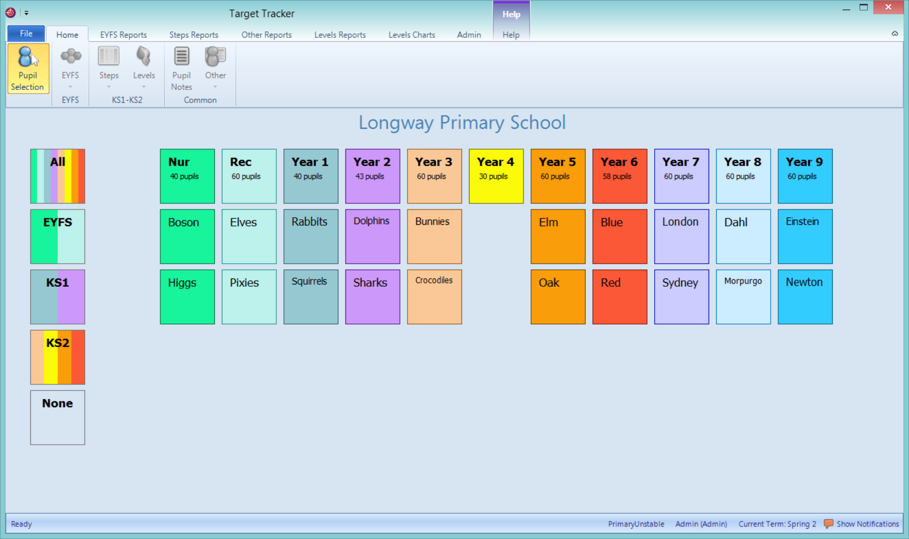

The Pupil Selection screen allows you to choose the pupils you wish to work with in Target Tracker. All available year groups and classes appear and may be ticked accordingly.

Your subscription type (EYFS, Primary or both) will affect what you can do with the year groups displayed. For example, if you subscribe to the Primary module only any year groups below year 1 will still be imported. You will be able to access their details in the Contextual grid but EYFS assessments and reports will not be available.

If you wish to work with the whole school use the All tile on the left. Similarly the other tiles on the left allow you to choose multiple year groups, or clear the selection, quickly.

!!! note
    Working with the whole school may be slower than working with a few classes. This will depend on the size of the school and the speed of the computer you are using.

The Tracking Grid, in particular, will take longer to display.

